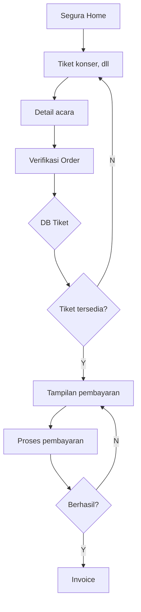

# API Reference

## Selamat Datang di MauTiket API

MauTiket API menyediakan endpoint untuk mengelola order tiket event. API ini mendukung flow lengkap mulai dari browsing event hingga pembayaran dan invoice.

## Flow Diagram



## Authentication

Semua endpoint admin menggunakan **API Key** authentication. Lihat [Authentication](/docs/api/authentication) untuk detail.

## Admin Order Endpoints

| Endpoint | Method | Description |
|----------|--------|-------------|
| `POST /events/:id/admin/orders` | POST | Buat order untuk customer |
| `GET /events/:id/admin/orders` | GET | List admin orders |
| `GET /events/:id/admin/orders/:id` | GET | Detail single order |
| `POST /events/:id/admin/orders/:id/checkout` | POST | Initiate payment |
| `GET /events/:id/admin/orders/:id/invoice` | GET | Download invoice |
| `POST /events/:id/admin/orders/:id/cancel` | POST | Cancel order |

## Base URL

```
https://api.mautiket.com
```

## Format Response

Semua response menggunakan format JSON:

```json
{
  "message": "Success message",
  "requestId": "abc123",
  "data": { ... }
}
```

## Error Handling

Lihat [Error Codes](/docs/api/errors) untuk detail error yang mungkin terjadi.

## Status Codes

Lihat [Status Codes](/docs/api/status-codes) untuk detail status order, payment, dan participant.
