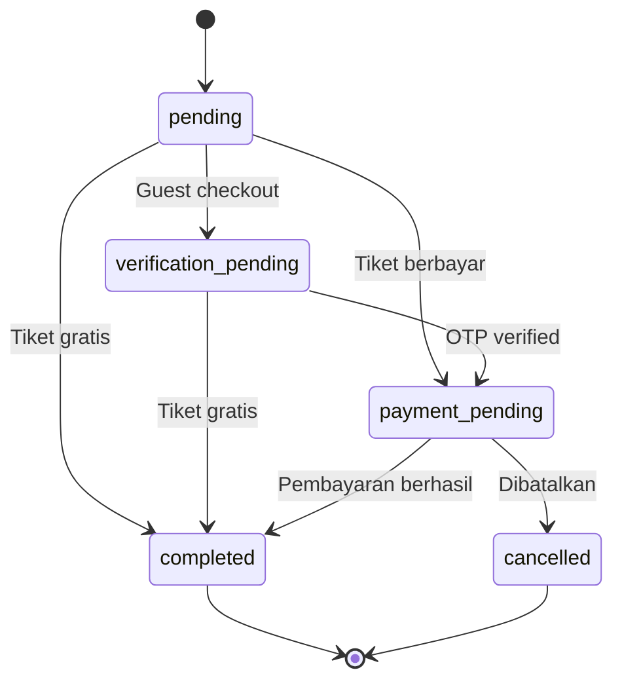
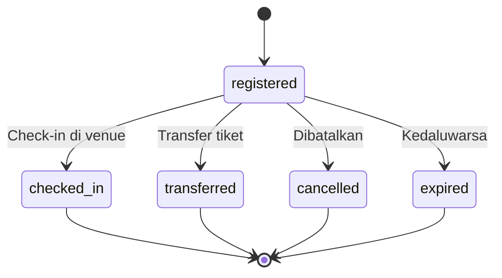

# Status Codes

## Order Status

| Status | Description |
|--------|-------------|
| `pending` | Order dibuat, menunggu verifikasi |
| `payment_pending` | Menunggu pembayaran |
| `verification_pending` | Menunggu verifikasi OTP |
| `completed` | Order selesai |
| `cancelled` | Order dibatalkan |

### Transisi Status

## Payment Status

| Status | Description |
|--------|-------------|
| `unpaid` | Belum dibayar |
| `paid` | Sudah dibayar |

## Participant Status

| Status | Description |
|--------|-------------|
| `registered` | Terdaftar |
| `checked_in` | Sudah check-in |
| `transferred` | Sudah ditransfer ke orang lain |
| `cancelled` | Dibatalkan |
| `expired` | Kedaluwarsa |

### Transisi Status

## Gender

| Value | Description |
|-------|-------------|
| `male` | Laki-laki |
| `female` | Perempuan |
